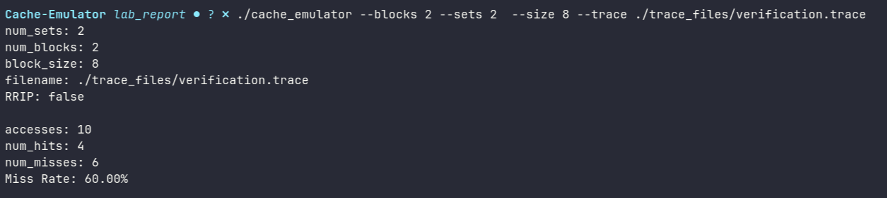

<center><h1>Lab 2: Cache Emulator</h1></center>

<center><h4>Connor Lidell, Eli Fisk, Paul Blair</h4></center>

<div style="margin-top: 50px;"></div>
<center><h2>Implementation Details</h2></center>

<div>
  For the Implementation of the Cache Emulator we choose to use C++. The cache.hpp file can be referenced to see the main features of the emulator. It contains a cache class that holds the main data structure that represents the cache. It is esentailly a 2-D array that can be thought of as a matrix of n-sets x m-blocks.
</div>

  ```
Block Datastructure

struct Block {
  int tag;
  bool valid;
  chrono::time_point<chrono::steady_clock> timestamp;
  int m;
}

Cache Datastructure

  vector<vector<Block>> cache;

```

As shown above the we represented the blocks as a struct that contains the tag, valid bit, timestamp, and replacement value m. The timestamp is used for enforcing the least recently used (LRU) replacement policy. The value m is used as the hot cold value, this is used to enforced the RRIP replacement policy.

<div style="margin-top: 50px;"></div>
<center><h2>Verification</h2></center>
<div>
  In order to verify that our cache emulator was working correctly we created a short hand trace file, and computed the hits and misses manually.
</div>

| Time | Address | Binary | Tag | Set | Set 0 | Set 1 | Eviction | Hit/Miss |
|------|---------|--------|-----|-----|-------|-------|----------|----------|
| T1 | `0x10` | `0001 0 000` | 1 | 0 | [**1**,-] | [-,-] |  | Miss |
| T2 | `0x20` | `0010 0 000` | 2 | 0 | [1,**2**] | [-,-] |  | Miss |
| T3 | `0x10` | `0001 0 000` | 1 | 0 | [**1**,2] | [-,-] |  | **Hit** |
| T4 | `0x30` | `0011 0 000` | 3 | 0 | [1,**3**] | [-,-] | Tag 2 (T2) | Miss |
| T5 | `0x20` | `0010 0 000` | 2 | 0 | [**2**,3] | [-,-] | Tag 1 (T3) | Miss |
| T6 | `0x30` | `0011 0 000` | 3 | 0 | [2,**3**] | [-,-] |  | **Hit** |
| T7 | `0x48` | `0100 1 000` | 4 | 1 | [2,3] | [**4**,-] |  | Miss |
| T8 | `0x30` | `0011 0 000` | 3 | 0 | [2,**3**] | [4,-] |  | **Hit** |
| T9 | `0x18` | `0001 1 000` | 1 | 1 | [2,3] | [4,**1**] |  | Miss |
| T10 | `0x18` | `0001 1 000` | 1 | 1 | [2,3] | [4,**1**] |  | **Hit** |

<div>
As seen in the table the hand trace resulted in four hits and six misses with a total of ten memory accesses. The miss rate can be calculated by.

</div>

<div style="margin-top: 20px;"></div>

$Miss Rate = \frac{\# Misses}{\# Memory Accesses} = \frac{6}{10} = .60 = 60\text{\% miss rate}$

We can compare the results of our cache emulator to verify it is working properly. This can be done by running the following command.

```
.\cache_emulator --blocks 2 --sets 2  --size 8 --trace ./trace_files/verification.trace
```


We can see with the output above we get the expected miss rate of 60%

<div style="margin-top: 50px;"></div>
<center><h2>Results</h2></center>
<h3>Experiment A: Associativity Sensitivity</h3>
<h3>Experiment B: The Comparison</h3>
<div style="margin-top: 50px;"></div>
<center><h2>Conclusion</h2></center>
